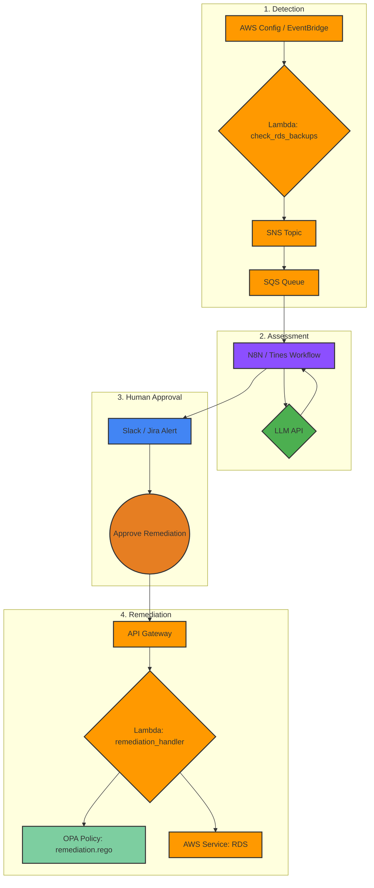

# Argus-Watch
[](https://example.com/build)
[](https://opensource.org/licenses/MIT)
[](https://example.com)

Intelligent, risk-assessed compliance monitoring and remediation for the cloud.

## 🌟 Overview
Argus-Watch, named after the hundred-eyed giant of myth, provides comprehensive, all-seeing monitoring of cloud environments. Its core mission is to transform noisy, low-context compliance alerts into intelligent, risk-assessed signals that allow security and GRC teams to focus on what truly matters. It achieves this by combining scalable, native-cloud monitoring with a low-code automation workflow, an LLM for enrichment, and a policy-as-code engine for secure, human-in-the-loop remediation.

## ✨ Core Features
*   **Scalable AWS Monitoring:** Natively integrates with AWS services like EventBridge to run scheduled checks across your environment.
*   **AI-Powered Risk Assessment:** Leverages a Large Language Model (LLM) to enrich findings with business context, assess impact, and assign a dynamic risk score based on a procedural risk framework.
*   **Policy-as-Code Remediation:** Uses Open Policy Agent (OPA) to define remediation logic as code, ensuring transparent, version-controlled, and secure fixes.
*   **Human-in-the-Loop Workflow:** Ensures that no remediation runs automatically. An analyst must approve every action from a Slack or Jira alert, providing a critical safety gate.
*   **End-to-End Audit Trail:** Captures a complete audit trail from detection, through the LLM's rationale, to the analyst's approval and the final remediation report.

## 🏛️ Final Architecture
The Argus-Watch architecture is a full-circle, event-driven pipeline for detection, assessment, and remediation.


1.  **Detection:** An EventBridge rule periodically triggers a Lambda function that scans for misconfigurations (e.g., RDS instances without backups). Findings are published to an SNS topic and sent to an SQS queue.
2.  **Assessment:** An automation platform (N8N/Tines) polls the SQS queue. For each finding, it queries an LLM, providing the finding and a procedural risk document. The LLM returns a structured JSON object with a risk assessment and rationale.
3.  **Approval:** The enriched alert is sent to an analyst in Slack/Jira. The alert includes an "Approve Remediation" button, which contains a secure link to our API Gateway.
4.  **Remediation:** Clicking the button calls the API Gateway, invoking the remediation Lambda. This Lambda evaluates the finding against an OPA policy to get the exact remediation steps, then executes them using the AWS SDK.

## 💻 Technology Stack
*   **Cloud Provider:** AWS
*   **Infrastructure as Code:** Terraform
*   **Serverless Compute:** AWS Lambda (Python 3.12)
*   **Messaging:** AWS SNS, AWS SQS
*   **API:** Amazon API Gateway
*   **Policy Engine:** Open Policy Agent (OPA)
*   **Automation Workflow:** N8N / Tines (or similar)
*   **AI:** Any GPT-4 level Large Language Model

## 🚀 Getting Started (Deployment Guide)

### Prerequisites
*   AWS CLI configured with appropriate permissions.
*   Terraform v1.5+
*   Python 3.12+
*   `make` for using the helper commands.

### Configuration
1.  **Clone the Repository:**
    ```sh
    git clone https://github.com/example/argus-watch.git
    cd argus-watch
    ```

2.  **Set Up Environment Variables:**
    The automation workflow (N8N/Tines) requires API keys to function. Create a file named `env.sh` from the template below and populate it with your secrets. **Do not commit this file.**

    **`env.sh` Template:**
    ```sh
    #!/bin/bash

    # Secret key for your LLM provider (e.g., OpenAI)
    export LLM_API_KEY="sk-..."

    # The API key for the Argus-Watch Remediation API Gateway
    # This will be output by Terraform after deployment.
    export ARGUS_API_GATEWAY_KEY="your-api-gateway-key"

    # The URL for your Slack Incoming Webhook
    export SLACK_WEBHOOK_URL="https://hooks.slack.com/services/..."

    echo "Environment variables set."
    ```

    Load the variables into your shell session:
    ```sh
    source env.sh
    ```

### Deployment Steps
1.  **Package the Lambda Functions:**
    The `Makefile` handles the process of creating the zip files for the Lambda functions, including installing dependencies.
    ```sh
    make package
    ```

2.  **Deploy the Infrastructure:**
    Use Terraform to deploy all the necessary AWS resources.
    ```sh
    make deploy
    ```
    After the deployment is complete, Terraform will output the `remediation_api_key_value`. Update your `env.sh` file with this value.

### Workflow Setup
1.  **Import Workflow:** Import the corresponding workflow JSON file into your N8N or Tines instance.
2.  **Configure SQS Trigger:** Configure the SQS Trigger node with your AWS credentials and the `findings_queue_url` provided as a Terraform output.
3.  **Configure Secrets:** Update the nodes for the LLM API call and Slack notifications to use the environment variables you set in `env.sh`.

## 🛣️ Project Roadmap
This Proof of Concept lays the foundation for a powerful GRC automation engine. Future enhancements could include:
*   **Expanded Monitor Library:** Add new detection modules for other AWS services like S3 (public buckets), IAM (unused roles), and EC2 (unencrypted volumes).
*   **Enriched OPA Policy Library:** Develop a comprehensive library of Rego policies to cover a wide range of automated remediations.
*   **CI/CD Pipeline:** Implement a GitHub Actions or Jenkins pipeline for automated testing of policies and Lambda functions, and for continuous deployment of the infrastructure.
*   **Findings Dashboard:** Create a simple web dashboard (e.g., using Streamlit or a static site) to view findings, track remediation history, and visualize risk trends.
*   **Multi-Cloud Support:** Abstract the core logic to add support for other cloud providers like Azure and Google Cloud Platform.

## 📄 License
This project is licensed under the MIT License. See the [LICENSE](LICENSE) file for details.