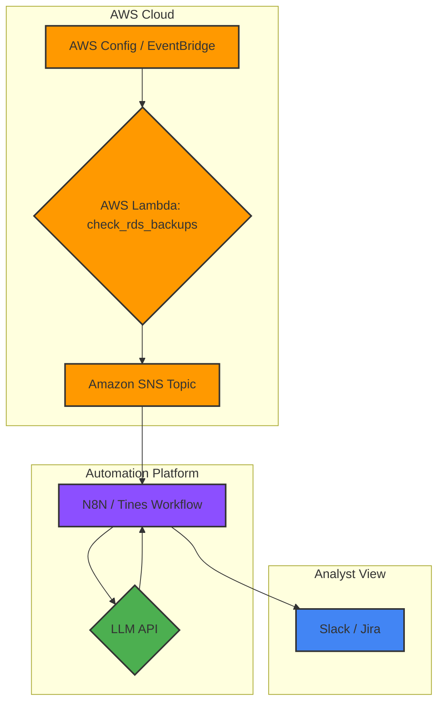

# Argus-Watch Architecture

## Data Flow
The architecture of Argus-Watch is designed as an event-driven pipeline to ensure scalability and real-time analysis. The flow begins with AWS native services. AWS Config continuously monitors AWS resource configurations, while Amazon EventBridge is scheduled to trigger periodic checks. When a non-compliant resource is detected or a scheduled check is initiated, an event is sent to a central AWS Lambda function. This function (`check_rds_backups`) is responsible for performing the detailed compliance validation.

Upon identifying a non-compliant resource, the Lambda function formats a standardized JSON finding. This finding contains critical details such as the Account ID, region, resource identifier, and a description of the issue. The finding is then published to an Amazon SNS (Simple Notification Service) topic. This topic acts as a decoupled messaging bus, broadcasting the finding to any subscribed endpoints.

An automation platform, such as N8N or Tines, is configured to subscribe to this SNS topic. When it receives a new finding, it triggers a pre-defined workflow. This workflow's primary task is to orchestrate the risk assessment. It makes a secure API call to a Large Language Model (LLM), sending the finding data along with a structured procedural risk document. This document provides the LLM with the necessary context, including the organization's risk matrix, business impact mappings, and known compensating controls. The LLM analyzes this information and returns an enriched finding, complete with a calculated risk score and a recommended initial action. Finally, the automation platform routes this intelligent, risk-assessed alert to its ultimate destination, such as a dedicated Slack channel or a Jira ticket, for human review and intervention.

## Architecture Diagram

