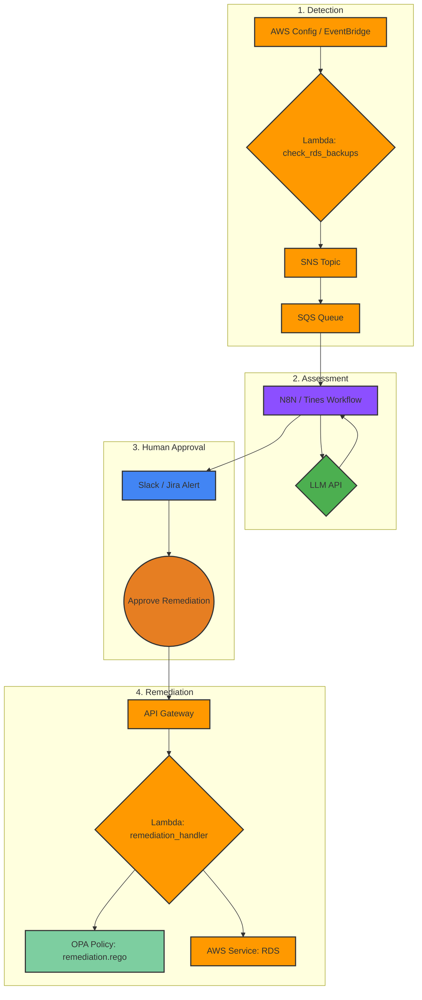

# Argus-Watch Architecture

## Data Flow & Remediation Loop
The architecture of Argus-Watch is designed as a full-circle, event-driven pipeline for detection, assessment, and remediation.

**1. Detection and Assessment:**
The flow begins with AWS native services. AWS Config continuously monitors AWS resource configurations, while Amazon EventBridge is scheduled to trigger periodic checks. When a non-compliant resource is detected, an event triggers the `check_rds_backups` Lambda function for detailed validation. Upon confirming a misconfiguration, the Lambda formats a standardized JSON finding and publishes it to an SNS topic. This topic fans out to an SQS queue, which decouples the detection mechanism from the assessment workflow. An automation platform (e.g., N8N, Tines) polls this queue, retrieves the finding, enriches it with business context from a procedural risk document, and queries an LLM to perform a dynamic risk assessment.

**2. Human-in-the-Loop Remediation:**
The AI-assessed alert is routed to an analyst in a tool like Slack or Jira. This alert is not just informational; it includes an "Approve Remediation" button. Clicking this button triggers the final, closed-loop part of the system. The approval action makes a secure, authenticated call to a dedicated Amazon API Gateway endpoint, passing the original finding data. The API Gateway invokes the `remediation_handler` Lambda function. This Lambda acts as an OPA-powered execution engine. It evaluates the finding against a Rego policy (`remediation.rego`) to determine the precise remediation action required. Based on the policy's decision, the Lambda dynamically constructs and executes the appropriate AWS API call (e.g., `rds:ModifyDBInstance`) to fix the misconfiguration. The result of the remediation is then reported back, closing the loop.

## Full Architecture Diagram

