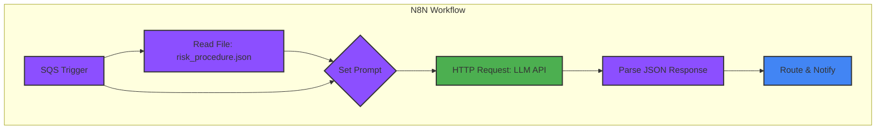

# Argus-Watch: N8N Automation Workflow Design

## Workflow Overview
This document outlines the design for the N8N automation workflow that powers the core risk assessment logic of Argus-Watch. The workflow's purpose is to create a scalable, low-code process that consumes compliance findings, orchestrates an AI-driven risk analysis, and routes intelligent alerts to the appropriate teams. It polls an SQS queue for new findings, reads a procedural risk document to provide context, constructs a detailed prompt, queries an LLM for analysis, and finally, formats and sends the enriched alert to a destination like Slack or Jira.

## Workflow Diagram

## Node Descriptions
*   **A. SQS Trigger:**
    *   **Function:** This node initiates the workflow. It is configured to periodically poll the `argus-watch-findings-queue` SQS queue for new messages. When a message (a security finding) is received, it passes the JSON payload to the next node.

*   **B. Read File:**
    *   **Function:** Before assessing risk, the workflow needs context. This node reads the `docs/procedural_risk_assessment.json` file from the local filesystem or a specified URL. This file contains the organization's risk matrix, business impact maps, and compensating controls.

*   **C. Set Prompt:**
    *   **Function:** This is a crucial preparation step. The node takes the finding data from the SQS Trigger (A) and the procedural risk data from the Read File node (B) and combines them into a single, structured prompt. It uses a predefined template (from `prompts/risk_assessment_prompt.md`) and injects the JSON data into the appropriate placeholders.

*   **D. HTTP Request (LLM API):**
    *   **Function:** This node sends the fully constructed prompt to the LLM's API endpoint. It is configured with the necessary authentication headers (e.g., API key) and makes a POST request with the prompt in the request body. It waits for the LLM to process the information and return a response.

*   **E. Parse JSON:**
    *   **Function:** The LLM is instructed to return a valid JSON object. This node takes the raw text response from the HTTP Request node (D) and parses it into a structured JSON object that can be easily used in subsequent steps. This allows the workflow to access specific fields like `assessedRisk` or `rationale`.

*   **F. Route & Notify:**
    *   **Function:** The final step in the workflow. This node takes the parsed JSON output from the LLM and formats it into a human-readable message. It can use conditional logic (e.g., based on the `severity` field) to route the alert to different destinations. For example, 'Critical' alerts might go to a PagerDuty service and a dedicated Slack channel, while 'Medium' alerts might only create a Jira ticket.
